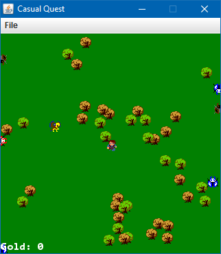

# CasualQuestJ
Basic RPG combat demo using assets from [Casual Quest BYOND](http://www.byond.com/games/iainperegrine/casualquest).

### Controls

* Move: Arrow keys
* Attack: Space
* Skills: 1-Z, 2-X, 3-C
* Reset: R
* Pause: P

### Items

Walk over them to pick them up.

They blink and disappear after 10 seconds. 

*  Cherry: Heals you for 1 health. Can't be picked up if your health is full. 
*  Gold Coin: Adds 1 to your Gold count. Pretty much useless, though.
*  Bottle: Fills your aura completely. 
*  Plum: Fills your health completely. 
*  Shield: Grants invincibility for 5 seconds. 

### Classes 
Press the number on your keyboard to change to it.

1.  Adventurer 
  * Health: 2
  * Primary:  Wooden sword (1 damage)
2.  Knight 
  * Health: 8
  * Primary:  Steel sword (2 damage)
3.  Mage 
  * Health: 4
  * Aura: 4 (regen: 1 aura per second)
  * Primary:  Fireball (mid-ranged, 1 damage, ranged)
  * Skill 1:  Big Fireball (long-ranged, 2 damage, 2 aura) 
  * Skill 2:  Seeker (long-ranged, 2 damage, 3 aura) This magical orb chases nearby enemies.
  * Skill 3:  Explosion (mid-ranged, 2 damage per fireball, 4 aura) Explosion magic is best magic. This launches 12 Big Fireballs all around you, but leaves you vulnerable afterwards. 

### Enemies

All enemies deal damage on contact with the player.

Enemies spawn from the edges of the map. Keep your distance from the edges. 

* __Bug__

  Moves slowly in cardinal directions. 
  *  
    * Health: 1
    * Damage: 1
  *  
    * Health: 2
    * Damage: 1
  *  
    * Health: 4
    * Damage: 2
* __Bird__ 

 Moves in straight diagonal lines pretty quickly and bounces on the sides.
  * 
    * Health: 1
    * Damage: 1
